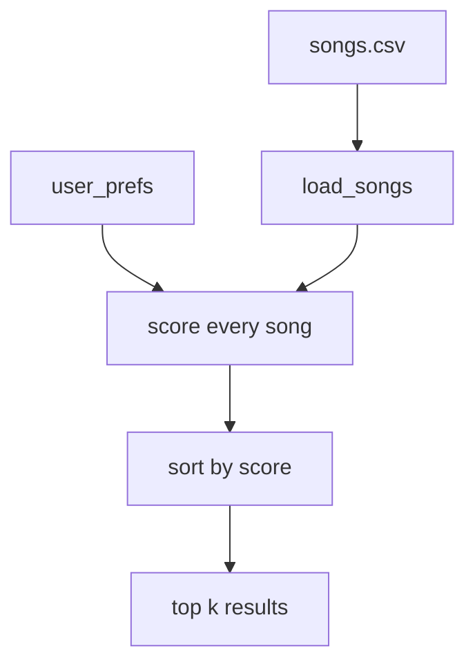

# Music Recommender Simulation

## Project Summary

This is a tiny content-based music recommender. You give it a "taste profile"
(your favorite genre, mood, target energy, whether you like acoustic stuff) and
it scores every song in a small CSV catalog, then returns the top matches with
a short list of reasons for each pick.

The point isn't to compete with Spotify. The point is to get a feel for how a
real recommender turns user data + item data into a ranked list, and to be
honest about where this kind of system breaks.

---

## How The System Works

### What real platforms do (the short version)

Big platforms like Spotify and YouTube Music don't use one algorithm, they use
a stack of them. Two of the main ideas:

- **Collaborative filtering** looks at *other people*. If a lot of users who
  liked the songs you liked also liked some other song, that other song gets
  recommended to you. It doesn't really care what the song *sounds* like, it
  just cares about overlapping behavior. Likes, skips, completion rates,
  playlist co-occurrence, all of that feeds in.
- **Content-based filtering** looks at *the songs themselves*. Each song gets
  described by features (genre, tempo, energy, mood, audio fingerprints, etc),
  and the system recommends songs whose features look like the ones you already
  enjoy. No other users required.

In practice the big apps blend both, plus a bunch of deep learning models that
predict things like "will this user finish this track" or "will this user save
this." Skips count more than you'd think.

### What my version does

My version is purely content-based, because that's the part you can actually
build and reason about in a few hours. It does:

1. Loads a small CSV of songs, where each song has descriptive features.
2. Takes a `UserProfile` describing what the listener wants.
3. Scores every song against the profile using a simple weighted rule.
4. Sorts by score and returns the top `k` results, each with a list of reasons
   like "genre match (+2.0)" so you can see why it picked them.

There's no learning happening. The weights are written by me, by hand. That's
on purpose, it makes the behavior easy to inspect and easy to break in
interesting ways for the bias section.

### Features used

`Song` (one row in `data/songs.csv`):

- `id`, `title`, `artist` — identity, not used for scoring
- `genre` — categorical (pop, lofi, rock, etc)
- `mood` — categorical (happy, chill, intense, etc)
- `energy` — float 0.0–1.0
- `tempo_bpm` — beats per minute
- `valence` — float 0.0–1.0, roughly "musical positivity"
- `danceability` — float 0.0–1.0
- `acousticness` — float 0.0–1.0

`UserProfile`:

- `favorite_genre` — string, exact-match against the song's genre
- `favorite_mood` — string, exact-match against the song's mood
- `target_energy` — float 0.0–1.0, the user's preferred energy level
- `likes_acoustic` — bool, whether to give a small bonus to acoustic tracks

The exact scoring weights and the full recipe live in the next section, after
Phase 2.

---

## Algorithm Recipe

For each song, add up points from these rules. Highest total wins.

- Genre matches `favorite_genre`: `+2.0`
- Mood matches `favorite_mood`: `+1.0`
- Energy closeness: `+1.5 * (1 - |target_energy - song.energy|)`
- `likes_acoustic = True` and `acousticness >= 0.6`: `+0.5`
- `likes_acoustic = False` and `acousticness >= 0.6`: `-0.3`

Genre is weighted higher than mood because it's a stronger signal of taste.
Energy gets a continuous score instead of a yes/no match since it's a number.



### Biases I expect

- A "pop" user probably never sees rock in the top 5, even if the rock song
  matches on energy and mood.
- Exact-string matching is rigid. "indie pop" earns nothing from a "pop"
  user even though they're basically neighbors.
- Pop/lofi show up more in my catalog than metal or classical, so users of
  rare genres will get less variety.

---

## Getting Started

### Setup

```bash
python -m venv .venv
source .venv/bin/activate
pip install -r requirements.txt
```

### Run

```bash
python -m src.main
```

#### Sample output (default profile)

```
Loaded songs: 18

=== Default profile (pop / happy / 0.8) ===
profile: {'genre': 'pop', 'mood': 'happy', 'energy': 0.8, 'likes_acoustic': False}

  Sunrise City - Neon Echo  [score 4.47]
    because: genre match (+2.0), mood match (+1.0), energy closeness (+1.47)
  Gym Hero - Max Pulse  [score 3.30]
    because: genre match (+2.0), energy closeness (+1.30)
  Rooftop Lights - Indigo Parade  [score 2.44]
    because: mood match (+1.0), energy closeness (+1.44)
  Night Drive Loop - Neon Echo  [score 1.42]
    because: energy closeness (+1.42)
  Block Party Heat - Flash Grid  [score 1.41]
    because: energy closeness (+1.41)
```

Sunrise City wins because all three main rules fire for it (genre match, mood
match, nearly exact energy). Gym Hero is second because it matches genre and
has close-enough energy, but its mood is "intense," not "happy."

### Tests

```bash
pytest
```

---

## Experiments

`src/main.py` runs 4 user profiles twice — once with default weights and
once with an experimental set (`energy x 2`, `genre x 0.5`) — so you can see
how sensitive the ranking is to weight changes.

Profiles tested:

- **High-Energy Pop** — pop / happy / 0.9
- **Chill Lofi** — lofi / chill / 0.3 / likes acoustic
- **Deep Intense Rock** — rock / intense / 0.95
- **Adversarial** — pop / sad / 0.9 / likes acoustic (deliberately conflicting)

Findings:

- The three "normal" profiles got sensible top-1 results (Sunrise City,
  Library Rain, Storm Runner).
- The adversarial profile returned pop/happy songs instead of the sad
  acoustic songs it asked for. Genre + energy beat mood + acoustic on raw
  points, so the system just ignored the actual request.
- When I halved genre weight and doubled energy, the top-1 songs barely
  moved. But mid-ranks shifted — ambient songs crept into lofi results,
  rock crept into pop results. Genre lock-in relaxed but didn't break.
- The adversarial profile got *worse* in the experiment because the only
  sad song in the catalog (Quiet Porch, energy 0.22) fell out of the top 5
  when energy was weighted more heavily against its target of 0.9.

Full pair-by-pair comparison in `reflection.md`. Bias writeup in
`model_card.md` section 6.

---

## Limitations and Risks

Short version:

- Tiny catalog (18 songs), so any conclusion about "what the algorithm
  does" is shaky.
- No understanding of lyrics, language, or cultural context.
- Exact-string matching on genre and mood means neighbors don't help each
  other ("indie pop" gets nothing from a "pop" user).
- Ignores user requests when genre + energy outrank mood + acoustic on
  points. The adversarial profile showed this clearly.

Full discussion in `model_card.md` section 6.

---

## Reflection

Building this made the "filter bubble" argument feel concrete. My
adversarial profile asked for sad + acoustic and got pop + happy because
the math said so. Nothing was broken, the weights just didn't encode what
the user actually wanted. That's the failure mode real recommenders get
criticized for, and it happens even with four rules and 18 songs.

The other thing I took away is that showing reasons makes a trivial system
feel trustworthy. Adding a reasons list to every recommendation turned a
pile of addition into something that looks like it's explaining itself.
That's worth remembering next time an app tells me "we recommend this
because..."

Full reflection in `model_card.md` section 9 and `reflection.md`.
