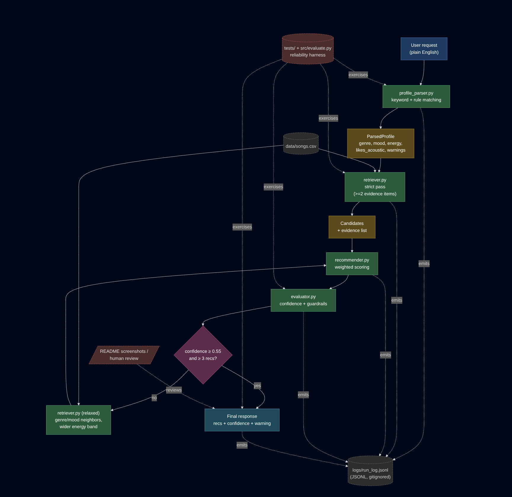

# VibeFinder: Applied AI Music Advisor

A small, local applied-AI system that turns a plain-English music
request into a ranked list of songs, with retrieval, an agent loop,
and a reliability harness wrapped around the original Module 3
recommender.

> "I need calm music for coding, low energy, acoustic if possible."
> &rarr; lofi / focused / energy 0.30 / wants acoustic
> &rarr; 5 songs ranked, average energy delta 0.07, confidence 0.84.

---

## Original Project

This is built directly on top of my Module 3 starter
**`ai110-module3show-musicrecommendersimulation-starter`**. The original
loaded an 18-song CSV catalog, took a `UserProfile` of (favorite
genre, favorite mood, target energy, likes_acoustic), and scored every
song with a hand-tuned weighted rule, returning a top-k list with
reasons. Useful, but the user had to already know what they wanted in
those four exact slots, and there was no notion of confidence,
retrieval, or whether the answer actually matched the request.

VibeFinder keeps that recommender intact (same scoring weights, same
explanation format) and wraps it in the rest of an applied AI system.

---

## What Makes This an Applied AI System

The assignment asks for at least one of: retrieval, agentic workflow,
fine-tuned/specialized behavior, or reliability testing. This project
includes three of them, all integrated into the request path:

- **Retrieval.** `retriever.py` runs a strict-then-relaxed candidate
  retrieval over the catalog with an evidence list (mood match, genre
  match, energy delta, acoustic match). The ranker only sees what
  retrieval kept.
- **Agentic workflow.** `advisor_agent.py` runs an observable loop —
  parse, retrieve, rank, evaluate, retry once with relaxed retrieval
  if confidence is below threshold — and writes every step as a JSONL
  event to `logs/run_log.jsonl`.
- **Reliability and guardrails.** `evaluator.py` produces a confidence
  score in `[0, 1]` from a hand-written rubric (genre/mood/energy/
  acoustic/coverage), `src/evaluate.py` runs a 7-case test harness
  against the live agent, and a `pytest` suite covers the parser,
  retriever, evaluator, and end-to-end flow.

The retrieval and confidence scores actually change behavior: a low
score triggers a relaxed retrieval retry, and contradictory or sparse
requests come back with explicit warnings instead of silently being
"answered."

---

## Architecture Overview



A user request flows top-to-right through `profile_parser`, then down
through `retriever` (strict pass) → `recommender` (weighted ranker) →
`evaluator` (confidence + guardrails). If confidence is below 0.55 or
fewer than three recommendations survived, the agent retries once
through `retriever` in relaxed mode (genre/mood neighbors, wider
energy band) before assembling the final response. Every stage emits
JSONL events to `logs/run_log.jsonl`. The reliability harness in
`tests/` and `src/evaluate.py` exercises the live pipeline against
fixed inputs.

Mermaid source: [`assets/diagrams/system_architecture.mmd`](assets/diagrams/system_architecture.mmd).

---

## Setup

```bash
python -m venv .venv
source .venv/bin/activate
pip install -r requirements.txt
```

Tested with Python 3.11+ on Linux. No paid APIs, no external services
— the whole pipeline runs locally and deterministically.

---

## How to Run

```bash
# Three sample requests, full agent trace per request:
python -m src.demo

# Reliability harness — 7 cases, prints pass/fail summary:
python -m src.evaluate

# Unit tests:
pytest -q
```

The original Module 3 entry point is still available:

```bash
python -m src.main   # original 4-profile recommender simulation
```

---

## Sample Interactions

### 1. Clean request — lofi/focused/acoustic

```
REQUEST  : Give me calm focused music for coding, preferably acoustic

PARSED PROFILE
  genre=lofi  mood=focused  energy=0.30  acoustic=True

AGENT STEPS
  [parse   ] genre=lofi mood=focused energy=0.30 acoustic=True warnings=1
  [retrieve] strict pass kept 8 candidates
  [rank    ] ranked 5 recommendations
  [evaluate] confidence=0.84 passed=True

TOP RECOMMENDATIONS
  Focus Flow — LoRoom         score 4.85
  Library Rain — Paper Lanterns  score 3.93
  Midnight Coding — LoRoom    score 3.82
  Spacewalk Thoughts — Orbit Bloom  score 1.97
  Coffee Shop Stories — Slow Stereo  score 1.90

WARNINGS
  - multiple mood hints found (focused, chill); picked 'focused'
```

### 2. Activity-driven request — gym/upbeat/happy

```
REQUEST  : I need upbeat happy music for the gym

PARSED PROFILE
  genre=hip hop  mood=happy  energy=0.75  acoustic=False

TOP RECOMMENDATIONS
  Block Party Heat — Flash Grid    score 3.34
  Rooftop Lights — Indigo Parade   score 2.49
  Sunrise City — Neon Echo         score 2.40

EVALUATION
  confidence=0.64  passed_guardrails=True
```

### 3. Adversarial / contradictory request

```
REQUEST  : I want sad acoustic music but still high energy

PARSED PROFILE
  genre=pop  mood=sad  energy=0.85  acoustic=True

TOP RECOMMENDATIONS
  Sunrise City — Neon Echo   score 3.46    (pop / happy)
  Gym Hero — Max Pulse       score 3.38    (pop / intense)
  Quiet Porch — Fern and Ash score 2.06    (folk / sad / acoustic)

EVALUATION
  confidence=0.61  passed_guardrails=True

WARNINGS
  - request asks for a low-arousal mood with high energy — catalog rarely has both
  - user wanted acoustic but most picks are not acoustic
```

That third case is the interesting one. The system can't actually
satisfy "sad + acoustic + high energy" because the catalog only has
one sad song and it isn't high-energy. Instead of pretending the top
result was a good match, the parser warns about the contradiction and
the evaluator warns about the acoustic miss.

Screenshots of the live demo go in
[`assets/screenshots/`](assets/screenshots/).

---

## Design Decisions

**Rule-based parser instead of an LLM.** I considered piping the
request through a small local model, but every option that wasn't
basically free either wanted an API key or shipped 4 GB of weights
for a homework project. The rule-based parser is uglier but fully
deterministic: every test runs the same way every time, every
warning is reproducible, and the model card can honestly say what
the limits are. The trade-off is real — anything that doesn't match
a keyword falls back to a default — but I'd rather be honest about
that than hide it behind an LLM that fails in less explainable ways.

**Two-stage retrieval, even at 18 songs.** The catalog is small
enough that the ranker could just score everything. Splitting
retrieval out anyway gave me a place to attach evidence ("we kept
this song because it matches your genre and is within 0.05 energy")
and a place to relax the rules on retry. It also makes the system
look like the actual shape of a real recommender pipeline, which I
think matters more than performance at this size.

**Confidence as a hand-written rubric.** Five weighted ratios:
genre 0.30, mood 0.25, energy 0.25, acoustic 0.10, coverage 0.10.
That's auditable in a way a learned scorer isn't. The threshold for
"passed guardrails" is 0.55, which I picked by running the harness
and finding that anything below that was a request the catalog
genuinely couldn't serve.

**Retry only adopts the relaxed result if it improved confidence.**
Otherwise the system would happily replace a strict, sensible answer
with a wider, fuzzier one and feel worse to the user. If neither
pass scored above threshold, the response carries the warnings and
the lower confidence, which is the honest outcome.

**The original recommender is untouched.** `recommender.py` is the
same file from Module 3 — same constants, same scoring, same OOP
and functional APIs. The agent calls it through `score_song`, so any
change to the original weights still flows through the system.

---

## Testing Summary

`pytest` covers parser keyword behavior, contradiction warnings,
empty/garbage input, retriever evidence and relaxed mode, evaluator
unit interval and guardrails, and the end-to-end agent path
including JSONL logging.

Most recent run:

```
20 passed in 0.02s
```

`python -m src.evaluate` runs the live agent against 7 reliability
cases:

```
Total cases     : 7
Passed          : 7
Failed          : 0
Average conf.   : 0.677
```

What I learned from running the harness while building it:

- The first version of the parser ignored "sad" as a mood signal
  unless the user also said "low energy." The harness caught that
  immediately because the `sad_acoustic_low_energy` case kept
  defaulting to energy 0.55. Adding a mood-default energy table
  fixed it.
- The adversarial case (`contradictory_sad_high_energy`) is meant
  to fail to satisfy the request. The reliability check on it is
  not "does the request succeed" but "does the system warn me that
  it can't" — which it does.
- Confidence below 0.55 in the harness usually means catalog
  thinness, not a parser bug. That matched my intuition from the
  original Module 3 reflection: 18 songs is not a lot.

---

## Limitations

- The catalog is still 18 songs. Anything I claim about behavior is
  shaky beyond this size.
- The parser is a keyword scanner. It doesn't understand grammar,
  negation, or sarcasm. "Anything but pop" still triggers the pop
  keyword.
- Confidence weights are hand-picked. They reflect what I think
  matters; a different student could justify a different set and
  get different pass/fail outcomes.
- Genre and mood neighbor tables are also hand-picked. They lean
  toward how I personally hear genre similarity, which is a bias.
- No personalization or memory across requests. Every call starts
  fresh.

---

## Ethics / Misuse

The risk surface is small — it's a local song picker — but the
framework still has the usual recommender problems in miniature:

- Catalog skew silently steers users away from underrepresented
  genres.
- "Confidence 0.84" sounds authoritative, and it isn't. It's a
  weighted average of five hand-coded checks. Showing it as a number
  could mislead a user into trusting it more than they should.
- A real system using this shape could be tuned to nudge users
  toward whatever the operator wants to promote, just by adjusting
  the genre weight in the ranker. The transparency of the weights
  helps that not be invisible, but doesn't prevent it.

What I did about it: every recommendation comes with a reasons list
and an explicit confidence number, contradictions raise warnings
instead of being papered over, and the model card calls out the
catalog skew directly.

---

## Video Walkthrough

> YouTube link goes here once recorded.

(The CodePath rubric mentions Loom — Loom doesn't have a Linux client,
so the walkthrough is hosted on YouTube instead. Same content: an
end-to-end run of the system, the AI feature behavior, and the
reliability/guardrail behavior on the three sample inputs.)

---

## AI Collaboration

I worked with Claude as a coding partner across this build. Two
specific moments worth flagging:

**A helpful suggestion.** When I was sketching the agent loop,
Claude suggested making the relaxed-retry conditional on actually
improving confidence — not just running it whenever the strict
pass scored low. That ended up catching a real bug: without the
check, a request that the strict pass had already answered cleanly
could end up with a wider, weaker result simply because confidence
had been near the threshold. The unit tests would have stayed
green; only the harness would have noticed.

**A flawed suggestion.** Earlier in the build, I asked for an
energy-from-mood default and the first version overrode explicit
energy phrases. So if the user said "sad music, high energy,"
the parser would still snap energy down to 0.30 because "sad"
mapped to it. That hid the contradiction the adversarial test
case is supposed to expose. I had to push back and constrain the
rule to "mood default applies *only* when no explicit energy
phrase was matched." After that change, the contradictory case
correctly produced both the high-energy reading and the
low-arousal warning.

The takeaway: AI tools are great at boilerplate and at suggesting
structures I hadn't thought of, but they will happily write
convenient logic that erases the very behavior the assignment is
meant to test. The reliability harness is what keeps me honest,
not the AI. (Full version of this reflection lives in
`model_card.md` §11.)

---

## Portfolio Reflection — what this project says about me as an AI engineer

Building this on top of Module 3 made the difference between a
"function that returns answers" and an "applied AI system" feel
concrete. The original recommender wasn't wrong, it just had no
opinion about whether its own answers were any good. Adding
parsing, retrieval, evaluation, and a retry loop turned it into
something that could *report on itself* — and the test harness
turned that report into something I could trust.

What I want this project to signal to a future employer is that
I default to building reliability scaffolding before fancy
behavior. I'd rather ship a deterministic pipeline with a
confidence score, observable agent steps, and a 7-case harness
than a flashier black-box that can't tell me when it's wrong.
A confidence number and a small harness caught more bugs in this
project than any amount of extra parsing logic would have,
because they made every change visible — and that's the habit I
want to carry into bigger systems.
